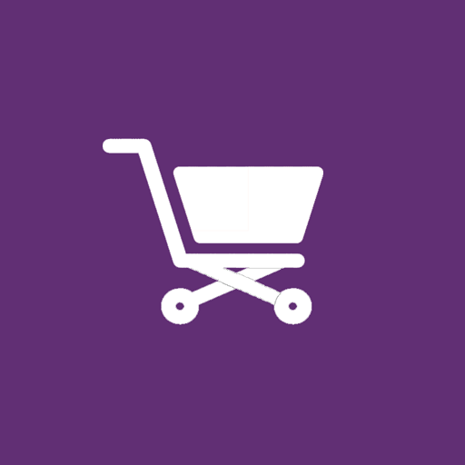

<h1 align="center">
  
</h1>

<p align="center">
  

 
</p>


## 💻 Project
An example of a grocery application with RN CLI, prop types, axios, react navigation and simple jest test, to help you make your supermarkets.

## 💻 User Access
- User: admin@gmail.com
- PAssWord: 123456

## :hammer_and_wrench: Features 

-   [ ] Authentication with Redux.
-   [ ] Save your favorite products;
-   [ ] List of all products online;
-   [ ] Allows you to buy any products;
-   [ ] Allows you to filter matches by category;

## ✨ Technologies

-   [ ] React Native
-   [ ] Async Storage
-   [ ] Vector Icons
-   [ ] React Native Svg e Svg Transform
-   [ ] Axios
-   [ ] Gradient colors 
-   [ ] Google Fonts
-   [ ] React Navigation Stack
-   [ ] React Native Gesture Handler
-   [ ] React Native Share
-   [ ] Redux
-   [ ] Redux Saga
-   [ ] React Native Sensitive Info

## 🔖 Layout

You can view the project layout through [desse link](https://www.figma.com/file/0kv33XYjvOgvKGKHBaiR07/GamePlay-NLW-Together?node-id=58913%3A83). It is necessary to have an account in the [Figma](http://figma.com/) to access it.

## running the project

Use **yarn** or **npm install** to install project dependencies.
Then start the project.

```cl
yarn android or npm android or react-native run-android
```

## 📄 Environment
 ```cl
BASE_URL=
API_KEY=
```


## 📄 Licence

This project is under the MIT license. See the file [LICENSE](LICENSE.md) for more details.

<br />

<div align="center">
  <small>Development for Alexandre carvalho marques - 2021/Jul</small>
</div>